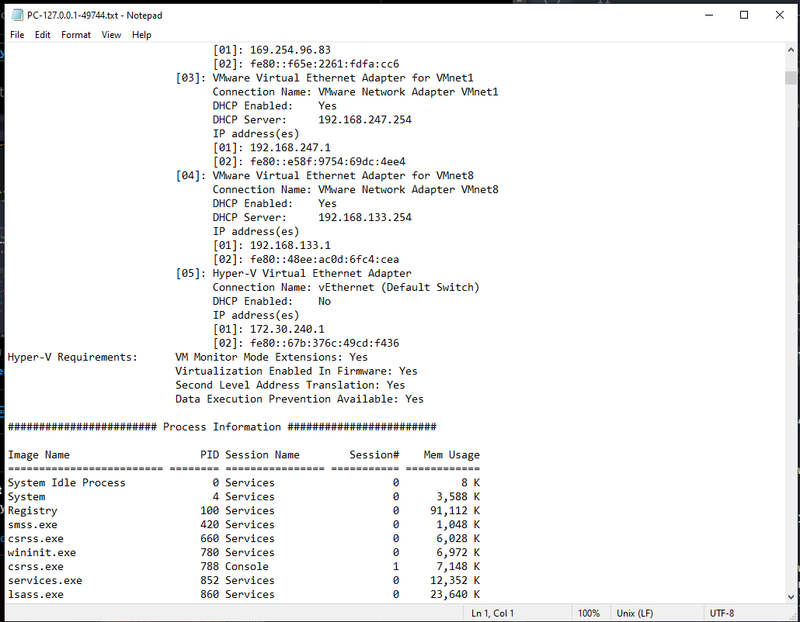

## Information Gathering for Windows 



A simple information gathering tool that collects basic system information, stores it in the Windows/Temp directory, and sends it to a specified receiver and automatically deletes itself upon system reboot.

> If you need to add a set of gathering techniques, it's easy to edit the gather_info.rs file. It was created to allow the addition of more functions!

Information it can collect 

* System Information
* Process Information
* User Information
* Network Information
* FileSystem Information
* Disk Information
* File Information
* Register Information
* Group Policy Related Checks [If Present then will save in info_gather.txt] File

For Deletion i have used [MoveFileExW](https://learn.microsoft.com/en-us/windows/win32/api/winbase/nf-winbase-movefileexw) with [MOVEFILE_DELAY_UNTIL_REBOOT](https://stackoverflow.com/questions/1013689/movefileex-with-movefile-delay-until-reboot-deleting-rather-than-moving). SOF Has Every Solution :) 


## Usage

```
cargo run 
```

OR

```
cargo build --release
./target/release/Data_collector.exe
```

For Receiver Please Visit Receiver code that can be found in this repository.

By [5mukx](https://x.com/5mukx)
