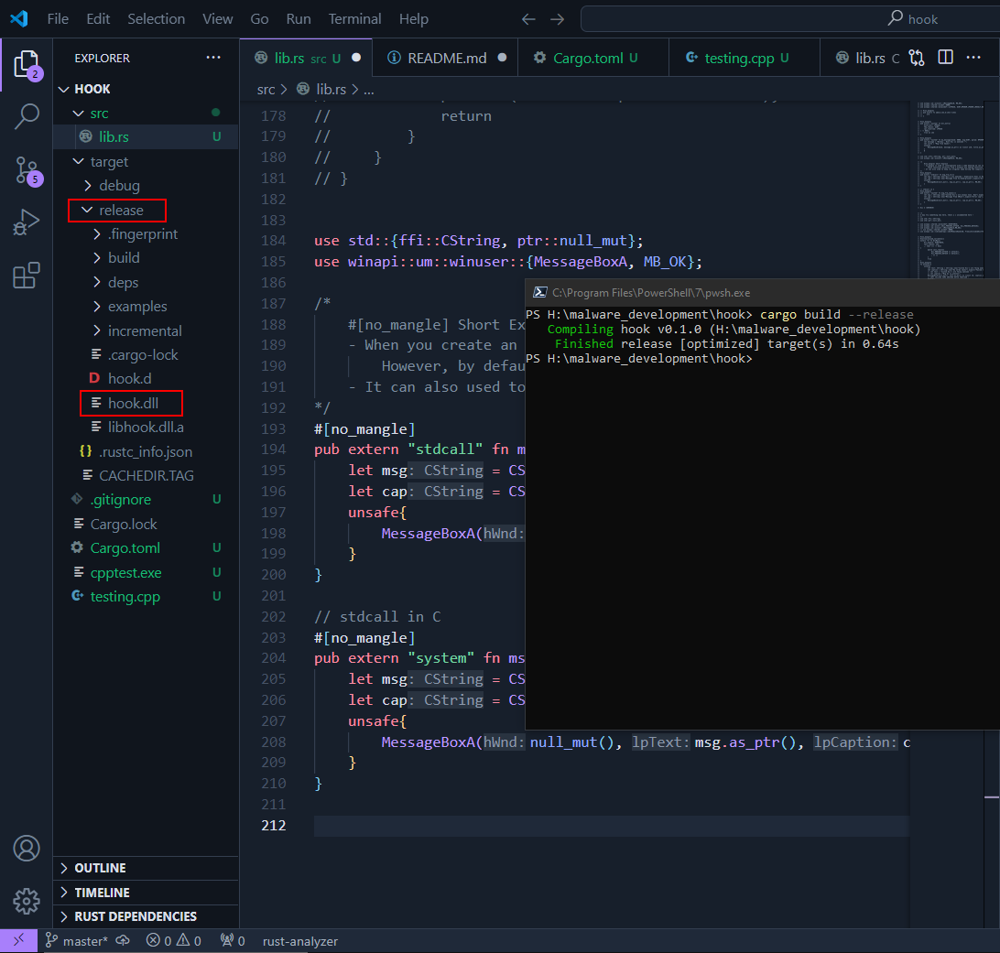
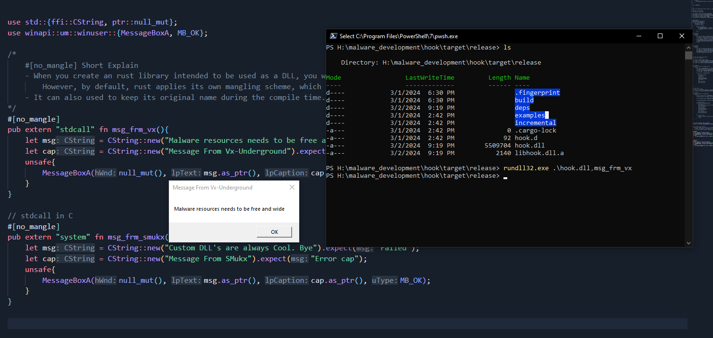
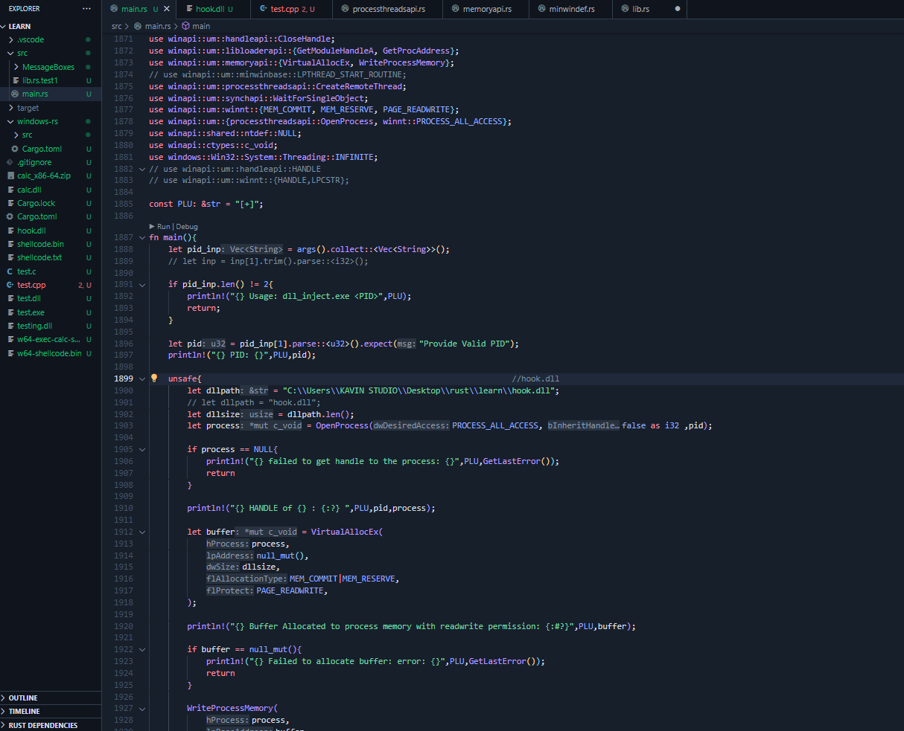
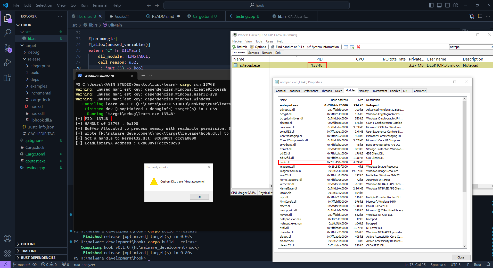
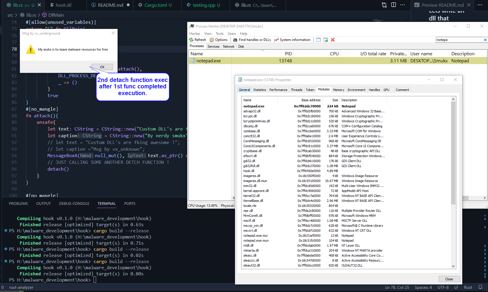
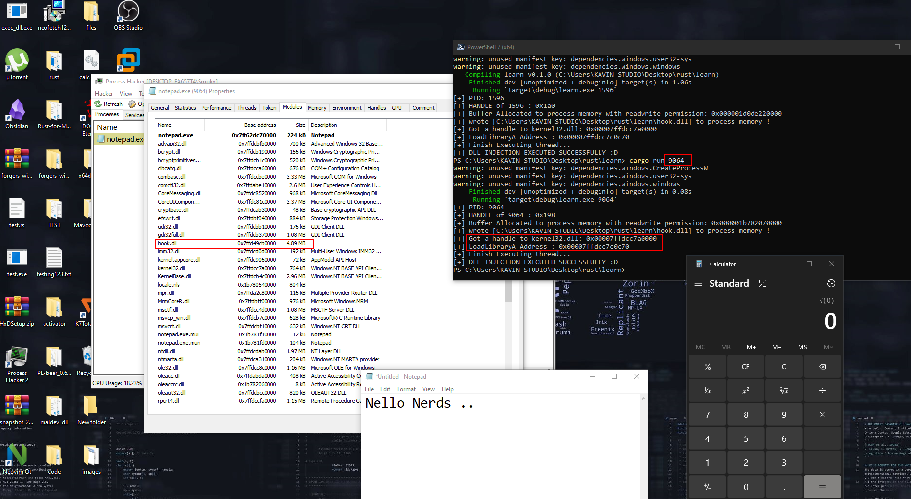
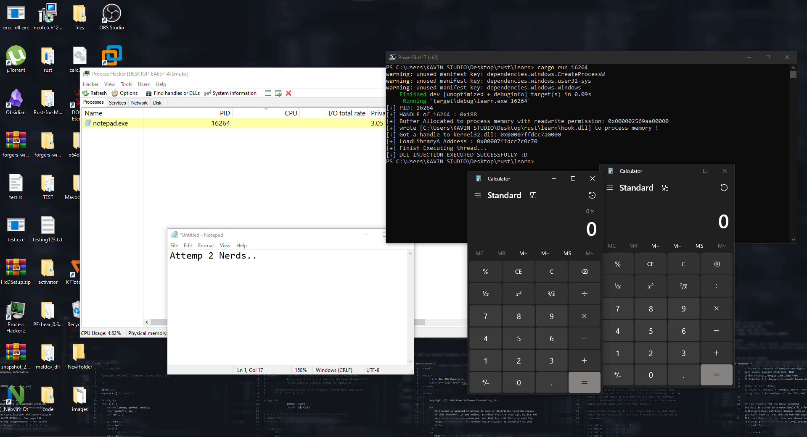
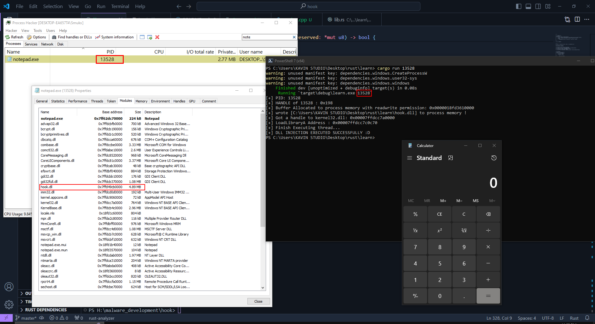

## DLL INJECTION USING RUST


Hello nerds. So today we are going to see How you can write your own dll on various methods and perform dll injection using Rust.  

--------------------------

**Note ::> This is not an complete tutorial of teching how they works underneath but an actual implemeting methods to create your own custom dll's and perform DLL injection. Feel Free to google if you got stuck**

--------------------------

### Creating DLL Files.

create an new --lib crate and add the following [lib] to your cargo.toml file to compile the following code into dll's. 

```
[lib]
crate-type = ["cdylib"]
```

Lets write this following sample program and compile it !

```

use std::{ffi::CString, ptr::null_mut};
use winapi::um::winuser::{MessageBoxA, MB_OK};

#[no_mangle]
pub extern "stdcall" fn msg_frm_vx(){
    let msg = CString::new("Malware resources needs to be free and wide").expect("Failed");
    let cap = CString::new("Message From Vx-Underground").expect("Error cap");
    unsafe{
        MessageBoxA(null_mut(), msg.as_ptr(), cap.as_ptr(), MB_OK);
    }
}

// stdcall in C
#[no_mangle]
pub extern "system" fn msg_frm_smukx(){
    let msg = CString::new("Custom DLL's are always Cool. Bye").expect("Failed");
    let cap = CString::new("Message From SMukx").expect("Error cap");
    unsafe{
        MessageBoxA(null_mut(), msg.as_ptr(), cap.as_ptr(), MB_OK);
    }
}
```

The raw code are posted in this repo. Feel free to check them out !

Above code here : [Code](https://github.com/Whitecat18/Rust-for-Malware-Development/blob/main/dll_injection/hook.dll.rs)

**Short Basics:**

**Why we use no_mangle on functions**

- In Rust, the no_mangle is used to instruct the compiler to not [mangle](https://www.google.com/search?q=mangle&sourceid=chrome&ie=UTF-8) the symbol name of a function or item

Ok but for what shit do i need to use it ?

- When you create an rust library intended to be used as a DLL, you want other languages (like C or C++) to be able to call your rust functions. However, by default, rust applies its own mangling scheme, which would make the function names unrecognizable to the external language.

- so when you use no_mangle the symbol name of the function or item remains exactly as you wrote it in your rust code. 

<br>



hook.dll file compiled in release folder.

lets go there and call the function using `rundll32.exe dllpath,func_name`



Woah... it works. so this is how dll works haa ..

ok so lets get into action and write an injector to inject dll into processes .

### Creating DLL Injector.

Many Hours Later...

 <br>

After Hours of solving bugs and erros, implementing new methods. I finally wrote an Proper Injector with ErrorHandling Capabilities. 



<h4> The Injector code can be found Here :<a href="https://github.com/Whitecat18/Rust-for-Malware-Development/blob/main/dll_injection/injector.rs"> Code </a></h3> 

**Lets try to inject it !!**





Yes we have successfully injected our DLL .. But wait till now we saw how we can implement multiple functions and MessageBoxes. So what about some Program executions !!

### lets wrtie something interesing. Lets write an dll that opens actual Applications !

The game begins ...

Lets write an Simple dll that opens calc.exe using CreateProcessA WinAPI func.

```
use std::ptr;
use std::ffi::CString;
use winapi::um::processthreadsapi::{STARTUPINFOA, PROCESS_INFORMATION, CreateProcessA};
use winapi::um::winbase::CREATE_NEW_CONSOLE;

#[no_mangle]
pub extern "stdcall" fn DllMain() {
    unsafe {
        let mut startup_info: STARTUPINFOA = std::mem::zeroed();
        startup_info.cb = std::mem::size_of::<STARTUPINFOA>() as u32;

        let mut process_info: PROCESS_INFORMATION = std::mem::zeroed();

        let application_name = CString::new("C:\\Windows\\System32\\calc.exe").expect("CString::new failed");

        // Create process
        let success = CreateProcessA(
            ptr::null(),
            application_name.as_ptr() as *mut i8,
            ptr::null_mut(),
            ptr::null_mut(),
            false as i32,
            CREATE_NEW_CONSOLE,
            ptr::null_mut(),
            ptr::null(),
            &mut startup_info,
            &mut process_info,
        );

        if success.is_null() {
            println!("Failed to open Calculator !");
            return
        }
    }
}
```

Calc.exe code can be found Here : [Code](https://github.com/Whitecat18/Rust-for-Malware-Development/blob/main/dll_injection/simple_calc.rs)

Lets compile and see if its works !



It works but i made a mistakes. when you run this dll . the calculator opens up multiple times becasue i didnt close handle for the Process . so lets rewrite the hook.dll that opens the calc.exe

When i tried to fix it guess what! i fuc*ed it up :()

Insted of fixing it , I buffed that error . It executes 2 calc at the time : | .




And some hours later ...

 <br>




**Yayy.. I Fixed it !! + Found one Golden Gem**

 <br>


**How i Fixed it ?**

First i Closed the handle using CloseHandle and WaitForSignalObject API's But i dont know why it does'nt works!

So to properly handle the dll's. I used some events such as ATTACH and DETACH and by the process i Closed its threads and processes. 

**The Golden Gem or Bug ?**

So when i execute my dll. i closed my notepad but noticed that still my notepad is running on the same PID !

I Tried to restart my Process Hacker but the notepad.exe is showing buy i already closed it .

when i detach my calc.exe manually , the process automatically closes it . Hmm thats interesting .. let me research more about it ;)

**Fixed calc.exe code can be found here [fixed_calc_dll.rs](https://github.com/Whitecat18/Rust-for-Malware-Development/blob/main/dll_injection/fixed_calc_dll.rs)**

Thats it nerds .. now you can create and rock your own custom dll and exec any shit using Rust !

I Tried to check if i get any red flags on my dll file on virustotal!


Looks like we are good to go !

### Thanks and about 
Follow me at Twitter: [5mukx](https://twitter.com/5mukx)

**REFLECTIVE DLL SOON..**
### Credits and Resources : 

https://doc.rust-lang.org/reference/linkage.html#:~:text=Static%20and%20dynamic%20C%20runtimes,runtimes%20for%20targets%20as%20appropriate

https://github.com/rust-lang/rfcs/blob/master/text/1510-cdylib.md#detailed-design

https://docs.rs/winapi/latest/winapi/

https://learn.microsoft.com/en-us/windows/win32/dlls/about-dynamic-link-libraries

https://learn.microsoft.com/en-us/cpp/build/exporting-from-a-dll?view=msvc-170

https://learn.microsoft.com/en-us/previous-versions/windows/desktop/mscs/implementing-dllmain


